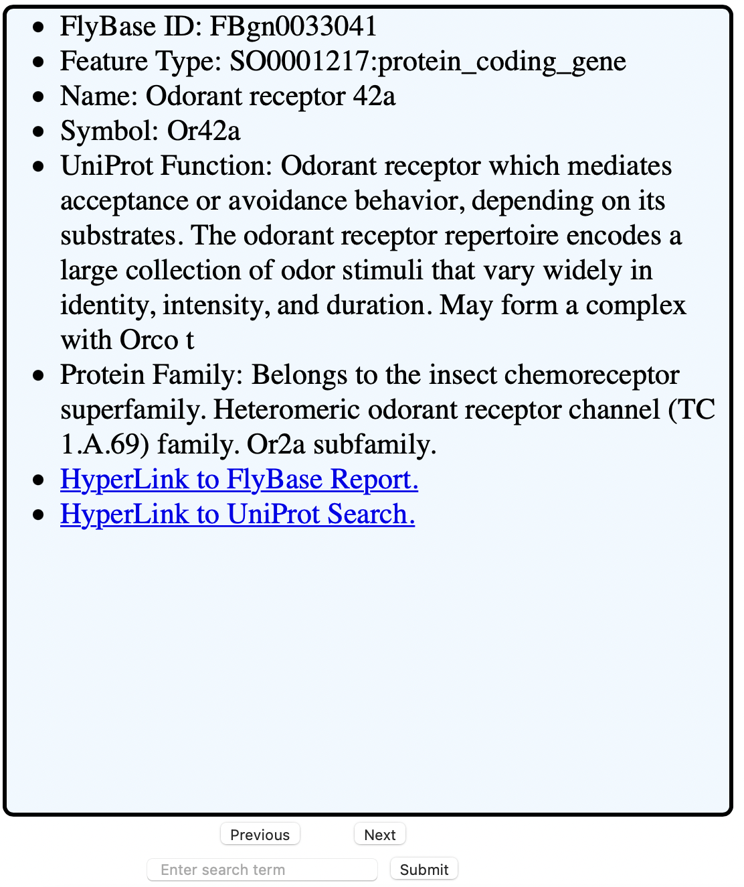

# Odorbase
Final project for the Advanced Practical Computer Concepts course @ Johns Hopkins.
A small SQL database of 128 D. Melanogaster genes involved with olfaction displayed in Tinderesque cards for ease of scrolling.

## Getting Started
The project is hosted on the class server bfx3.aap.jhu.edu.

### Prerequisites
To view the project, the user must be connected to the Johns Hopkins network in person or via the Pulse Secure VPN.  Access to the VPN is contingent on setting up the VPN with a JH username and password.

### Viewing on a browser.
Once connected to the network, open your favorite browser and enter the URL as:
http://bfx3.aap.jhu.edu/skyllma1/final_project/code/odorbase.html.

At first, an introduction card welcomes the user to the odorbase browser.  Once the user clicks on the Next button, the first Tinderesque card will be displayed.  The search bar will also fade in to allow for search functionality.  An example screenshot is included below.

Using the Next and Previous buttons will move forward and backward in the stack of cards.  As new cards are generated for the stack, a random entry is accessed to then be rendered.  When a search term is entered in the search bar and submitted via the submit button the program will search the Odorbase SQL database for exact matches of FlyBase IDs, names, or symbols.  Additionally, non-exact matches will be generated with the descriptions of the protein's function and protein family.  A successful search will generate an alert of the amount of matches generated while each match will generate a card at the end of the stack.  The user must move forward in the stack to then view the generated card.

A hyperlink is included at the bottom of the card to guide the user to the FlyBase report for the gene being displayed.  Another hyperlink is included to guide the user to a UniProt database search for the symbol of the gene being displayed.  Either hyperlink will open a new tab in the user's browser.

## Author
Sebastian Kyllmann.  GitHub Profile: https://github.com/snk5040
